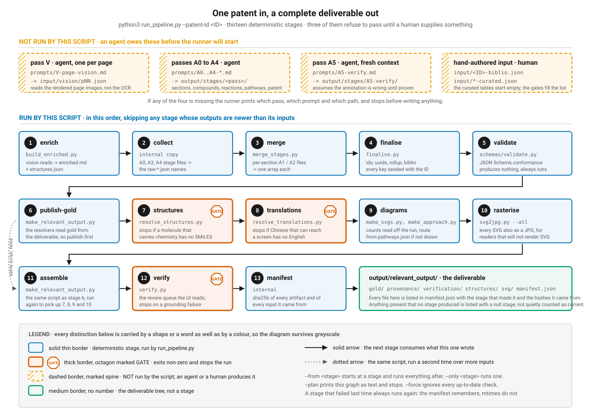

# The pipeline

One entry point. One patent in, the whole deliverable out.

```bash
python3 run_pipeline.py --patent-id CN104292137A
```



> Sixteen deterministic stages, in the only order that satisfies the real
> dependencies between them. Three of them are gates: they exit non-zero and stop
> the run rather than shipping something a human has not supplied. The top band is
> what the runner does **not** do, and refuses to start without.

---

## Why this exists

The annotation passes A0 to A5 produce the gold. Everything that makes the gold
*usable* was a series of scripts run by hand: structures, translations, diagrams,
the deliverable tree, the verification file the reviewer UI reads. The order lived
in one person's head.

Run patent number two and you got the gold and nothing else. No structures, so the
verification contract's `structure_svg_path` was null on every claim. No
translations, so every quote reaching a reviewer was in Chinese. No route diagram,
or worse, the *previous* patent's route diagram, still asserting the previous
patent's eight steps under the new patent's id. Nothing said so.

This is that order, written down, executed, and hashed.

---

## What the runner does not do

**The LLM annotation passes are not run by this script.** Pass V and pass A5 need
the rendered page images and an agent; A0 to A4 need the prompts and a context. A
subprocess cannot do any of it.

What the runner does instead is render this patent's prompts, then check whether
each pass's output is there. If it is not, it prints which pass is missing, which
prompt produces it, where the result must land, and how many times to run it, then
exits 3.

```
pass V   MISSING
         prompt : output/prompts/CN104292137A/V-page-vision.md
         writes : input/vision/p*.json
         how    : one agent per rendered page in input/pages/, in parallel
```

The prompt it names is the **rendered** one, not the template. `prompts/*.md` still
carries a patent id, because a prompt is read by an agent rather than imported by a
process, and an agent following a template faithfully would stamp the wrong id into
the new patent's gold. `render_prompts.py` fills it in, and it is stage 1 so that
the file this message names exists by the time the message is printed.

It never half-runs. Either every prerequisite is present and the run proceeds, or
none of it does.

---

## The stages

| # | stage | runs | produces | gate |
|---:|---|---|---|:--:|
| 1 | `prompts` | `render_prompts.py` | `output/prompts/<ID>/*.md`, the annotation prompts with this patent's id in them | |
| 2 | `enrich` | `build_enriched.py` | `input/<ID>-enriched.md`, `-numbered.md`, `output/structures.json` | |
| 3 | `collect` | internal copy | `output/00-sections.json`, `raw-pathways.json`, `raw-patent.json` | |
| 4 | `merge` | `merge_stages.py` | `output/raw-compounds.json`, `raw-reactions.json`, the two provenance files, the A4 rollup | |
| 5 | `finalise` | `finalise.py` | `compounds.json`, `reactions.json`, `pathways.json`, `patent.json`, the equivalence and sections indices | |
| 6 | `validate` | `schemas/validate.py` | nothing; exits non-zero on a schema violation | |
| 7 | `publish-gold` | `make_relevant_output.py` | `relevant_output/gold/`, `provenance/`, `verification/`, `FINDINGS.md`, `AUDIT.md` | |
| 8 | `structures` | `resolve_structures.py` | `output/structures-resolved.json`, `output/structures/<slug>.svg` | yes |
| 9 | `translations` | `resolve_translations.py` | `output/translations.json` | yes |
| 10 | `diagrams` | `make_svgs.py`, `make_approach.py` | `svg/m1` to `m5`, `svg/approach.svg` | |
| 11 | `rasterise` | `svg2jpg.py --all` | `svg/*.jpg` | |
| 12 | `assemble` | `make_relevant_output.py` | the deliverable again, now including structures, translations and diagrams | |
| 13 | `visual` | `make_visual_evidence.py` | `relevant_output/visual/`: the page index, the structure comparisons, the drawing claims | yes |
| 14 | `verify` | `verify.py` | `relevant_output/verification/checks-<ID>.json` | yes, non-blocking |
| 15 | `selfcheck` | `verify_selfcheck.py` | nothing; grades the verification engine's own output | |
| 16 | `manifest` | internal | `relevant_output/manifest.json` | |

### Two things about that order that are not obvious

**`make_relevant_output.py` runs twice, and has to.** `resolve_structures.py` and
`resolve_translations.py` read the gold from `output/relevant_output/gold/` first
and fall back to `output/` only when it is absent. So on any re-run they would
resolve against the *previous* run's gold unless the deliverable is republished
first. Stage 7 publishes the gold the resolvers read; stage 12 picks up what they
produced. The script is a pure copy plus two regenerated markdown files, so running
it twice costs nothing and changes nothing on the second pass.

**`collect` used to be a `cp` somebody typed.** A0, A3 and A4 each write one file
into their stage folder, and `finalise.py` reads them from `output/` under a
different name. That copy was not written down anywhere. It is a stage now, and it
copies rather than moves, so `output/stages/` stays the untouched record of what
each pass actually returned.

---

## The gates

A gate is a stage that refuses to pass until a human supplies something no
deterministic step can derive. There are three.

### `structures` - a molecule that carries chemistry has no structure

A molecule carries chemistry when it is the product of some reaction, or when it
appears in a reaction-compound row with both `mass_g` and `mmol`. The first because
a route with an unknown product is not a route; the second because such a row is an
implicit claim about molecular weight, and checking that claim is the most valuable
thing to do with a patent.

On failure the stage prints the missing identifiers and a JSON stub ready to paste
into `input/structures-curated.json`:

```
  2 carry chemistry and have NO structure. FAIL
    thionyl chloride   (mass_g + mmol)
    triethylamine   (mass_g + mmol)
```

**Check every hand-authored SMILES atom by atom against the name.** There is no
OPSIN and no network here, so nothing verifies it except a human doing it, and a
wrong structure does not fail loudly - it corrupts a mass balance quietly.

### `translations` - Chinese that can reach a screen has no English

Every compound identifier, every alias, every provenance `quote_zh`, every quote on
an A5 finding, and every source line that carries Chinese. The reviewer the
deliverable exists for does not read Chinese and has twenty minutes.

On failure the stage prints the missing strings grouped by where they surface, and
a stub for `input/translations-curated.json`.

### `verify` - a number or a quote is not on the lines the record cites

The hallucination check. `verify.py` matches every claimed value against the source
lines the record itself cites and exits non-zero when a `grounding` check fails.

### Two stages that only report

`validate` and `selfcheck` produce no artifact. They run every time and they exit
non-zero when what they are grading is wrong, which is the point: a stage that
produces nothing cannot be skipped for being current.

### One gate does not stop the run

`verify` is a gate and sets the exit code, but the stages after it still run.

A grounding failure says the **annotation** is suspect. It does not say the page
images are suspect, and the visual evidence, the page index and the structure
comparisons are exactly what a human reaches for at that moment. Blocking them
behind a red gate removes the evidence at the point it is most needed. It also put
the visual stage back where it started: produced only when somebody ran the script
by hand, which is the gap this pipeline exists to close, reappearing one stage
downstream of a gate that is red on purpose and may stay red for a long time.

`visual` now runs *before* `verify` anyway, because it consumes nothing `verify`
produces; the old order was incidental, not causal. `selfcheck` runs after, because
grading the engine is exactly what you want when the engine's gate is red.

Nothing is swallowed. The run ends with:

```
pipeline reached the end: CN104292137A  (A GATE FAILED, see below)
========================================================================
GATE FAILED: verify (exit 1). THIS RUN IS NOT CLEAN.
Stages that ran anyway, because they consume nothing the failed gate
produces:  selfcheck
Their output is current for this gold. The gold itself is what the gate is
questioning, so read the gate's message above before trusting any of it.
```

`structures` and `translations` stay fully blocking, because everything downstream
genuinely consumes what they produce.

### What the runner does with a blocking gate

Stops. Prints the stage's own message unmodified, says how to resume, and exits 2.

```
STOP  the structures stage gate did not pass (exit 1).
      Supply it, then: python3 run_pipeline.py --patent-id <ID> --from structures
```

It never routes around one, and it never treats a gate failure as a warning.

**One trap worth knowing about.** Every gated stage writes its artifact and *then*
fails: `resolve_structures.py` writes `structures-resolved.json` before it reports
what is missing, and `verify.py` writes a 3 MB checks file before it reports a
grounding failure. A minute later every output is present and newer than every
input, and a purely mtime-based runner would call the stage current and walk past
the failure. So the manifest records each stage's outcome, the runner reads it back
at plan time, and **a stage that failed last time always runs again.**

---

## Skipping, and the plan

Every stage declares its inputs and its outputs. A stage is skipped when every
output exists and the sha256 of every input and every output is exactly what the
manifest says it last ran with.

**Not mtimes.** Two things rule them out, and both were found by watching a run
refuse to settle. `make_relevant_output.py` copies with `shutil.copy2`, which
*preserves* the source mtime, so a copied file is never newer than what it was
copied from and the stage re-runs forever. And a gated stage writes its artifact
and then fails, so a minute later every output is present and newer than every
input and an mtime rule walks straight past the failure. Hashing the tree costs a
fraction of a second and gives an answer that survives a `touch`, a copy, a
checkout and a clock change.

**The printed plan is a forecast, not the decision.** Currency is re-evaluated
immediately before each stage runs, because running a stage rewrites the next
stage's inputs. Judging all sixteen up front and then executing that frozen list
produced a real and quiet failure: change one field in `input/<ID>-biblio.json` and
the forecast says "RUN finalise, skip publish-gold", which is true when it is
computed and false one second later, because `finalise` has just rewritten
`patent.json`. The result was `output/patent.json` holding the new value,
`gold/patent.json` holding the old one, and the manifest recording `publish-gold:
current` - the one question the manifest exists to answer, answered wrongly.

A stage that changes its mind says so, in both directions:

```
--- publish-gold: forecast said skip, running it: input output/patent.json changed
--- assemble: forecast said run, now current: every input and output matches the manifest
```

The second line is the same mechanism saving work: delete one structure SVG,
`structures` rebuilds it byte-identically, and `assemble` correctly declines to run
because nothing it consumes actually moved.

The plan is printed before anything executes, always:

```
pipeline: CN104292137A
plan     3 to run, 9 current, 0 absent, 1 not selected

  ---- enrich                vision page reads -> enriched markdown ...
  RUN  finalise              deterministic ids and uuids, rollup, bibliographic merge
                             input output/raw-compounds.json changed
  RUN  structures     [gate] identifier -> drawable molecule over five tiers ...
                             last run: failed (1)
```

| flag | effect |
|---|---|
| `--plan` | print the plan and stop |
| `--list` | list the stages and stop |
| `--from <stage>` | start there, run everything after |
| `--only <stage>` | run exactly that one |
| `--force` | run everything, ignoring every up-to-date check |
| `--patent-id <ID>` | which patent; discovered from `input/*-biblio.json` if omitted |

**The blast radius is stage-shaped, not file-shaped.** Delete one diagram and the
`diagrams` stage rebuilds all six, because `make_svgs.py` writes all its outputs in
one process and the runner cannot ask it for less. The plan names the file that
went missing, and the rebuild is byte-identical for the five that did not need to
change, so nothing drifts. But do not read the manifest and expect a one-file
delete to cause a one-file rebuild.

| exit | meaning |
|---:|---|
| `0` | everything ran or was already current |
| `1` | a stage failed |
| `2` | a gate did not pass |
| `3` | the LLM annotation passes have not been run |
| `4` | this pack holds a different patent's work |
| `5` | the bibliographic record is missing or malformed |

Running twice changes nothing. Verified three ways: two `--force` runs produce a
byte-identical tree including the manifest; a `--force` run followed by a plain run
moves only the per-stage `status` fields in the manifest; and two plain runs are
byte-identical.

`verify.py` stamps its output with a build timestamp, so the runner pins
`SOURCE_DATE_EPOCH` to the newest mtime among the hand-authored inputs
(`input/*-biblio.json`, `input/*-curated.json`, `input/vision/`). That is still an
honest "as of", it moves when somebody changes an input, and it does not move
merely because the pipeline rebuilt itself.

---

## The manifest

`output/relevant_output/manifest.json`. Every artifact, the stage that produced it,
its sha256 and its size, and the sha256 of every input it was built from.

```json
{
  "path": "output/relevant_output/structures/tembotrione.svg",
  "sha256": "…", "bytes": 4213,
  "stage": "structures",
  "input_sha256": ["…", "…"]
}
```

**The deliverable holds a SECOND copy of eleven artifacts, and that is a staleness
generator.** `output/translations.json` and `gold/translations.json` are the same
file with a stage in between, and the screen and the export read the copy. So a fix
landed in `output/` looks applied everywhere except where anyone can see it, until
the copy stage runs.

That is not hypothetical. It hid a real correction for ten minutes: two reagent
concentrations were fixed in `output/translations.json`, `assemble` had not
re-copied, and the deliverable went on saying "sodium hypochlorite" where the stage
had written "15% sodium hypochlorite solution". The gold recorded 500 g of the
reagent rather than 500 g of a 15% solution, which is 28 equivalents against a
haloform oxidation that needs three, instead of a sensible 4.2.

Two things now stop it. The copy stages declare every file they read, so a change to
any of the eleven makes them stale. And **the manifest asserts the copies agree
before it certifies anything**, failing the run if they do not:

```
FAIL  1 artifact(s) in the deliverable do not match their source in output/.
  output/relevant_output/gold/translations.json does not match output/translations.json
```

The manifest records the result either way, as `deliverable_matches_output` and
`stale_copies`, so a consumer never has to take its word for the one thing it is
for. The structural fix would be a single copy rather than two; until then this is
the assertion that makes the second copy safe.

**`stages[]` and `artifacts[]` answer different questions and are allowed to
disagree.** A `stages[]` row means *this stage last ran with these hashes*, so a
stage that did not run this time carries its previous row forward untouched.
`artifacts[]` is what is on disk right now, always re-read. When an artifact's live
hash differs from what its stage last produced, the row says so in a `note`:
somebody edited an artifact by hand, and that is worth seeing rather than
smoothing over.

Rewriting a skipped stage's row from today's tree is how the frozen-plan bug
survived a second run. The buggy run left `publish-gold` stale, then wrote
`publish-gold`'s row from the tree it had just failed to update. The row agreed
with disk, `is_current()` called the stage current, and the staleness was laundered
into the record. A stage's row is now only rewritten by that stage running.

That is what lets a consumer ask *are these assets current for this gold* and get
an answer from hashes rather than from file times. It is also what lets the
reviewer UI say so.

Two deliberate properties:

- **No timestamp anywhere.** A `generated_at` field would make every second run a
  diff, and byte-level idempotence is worth more than knowing the wall clock.
- **Anything in the deliverable that no stage produced is listed with a null
  stage**, and split into two kinds, because the difference matters. A
  hand-authored file that some stage *reads* is a legitimate input that happens to
  live in the tree, and says so. A file that nothing writes and nothing reads is a
  **stray**, counted separately as `totals.artifacts_stray`. On a healthy run the
  strays are exactly the hand-written `README.md` and the reviewer's own
  `verdicts-<ID>.jsonl`. Anything else appearing there is the failure this
  pipeline exists to fix, so it is reported rather than hidden.

The manifest is written even when a gate stops the run, with the failing stage's
status recorded. A stopped run is exactly when a consumer most needs to be told
the assets are not current.

**One trap when debugging by hand.** `verify.py` stamps `generated_at` from the wall
clock unless `SOURCE_DATE_EPOCH` is set, and the runner is what sets it. So a bare
`python3 verify.py <ID>` writes a checks file whose sha256 disagrees with the
manifest for no semantic reason at all: the content is identical apart from that one
line. If you are comparing hashes, go through the runner, or strip `generated_at`
before you diff. Two people have now lost an hour to this.

---

## Running a new patent

Nothing below mentions `CN104292137A`, and nothing in the scripts does either. The
id comes from `--patent-id`, from `$ANNOTATION_PATENT_ID`, or from the one
`input/<id>-biblio.json` in the pack.

1. **Put the source in place.** The PDF in `input/pdf/<ID>.pdf`, and every page of
   it rendered to PNG at 200 dpi in `input/pages/`, named `p01.png` onward. Pass V
   reads those pixels, because the PDF has no text layer.

   ```bash
   pdftoppm -r 200 -png input/pdf/<ID>.pdf input/pages/p
   ```

   The runner reports both of these as missing, with that command, so you do not
   have to remember it.

2. **Write `input/<ID>-biblio.json`.** `schemas/biblio.schema.json` is the
   contract and documents every field. The runner validates it as a whole before
   any stage runs and reports every problem at once, rather than failing at one
   bare `b["key"]` at a time several stages in.

   Two things worth knowing. `grant_date` is nullable, because most published
   applications are never granted and making it fatal made the pack unusable for
   them. And `jurisdiction` is the fallback country for any inventor given as a
   bare name, so a wrong value there mislabels every inventor; give inventors as
   `{"name": ..., "country": ...}` objects where it matters.

3. **Start the two curated tables empty.** The gates will tell you what goes in
   them; guessing first wastes the trip.

   ```bash
   echo '{"patent_id":"<ID>","entries":{},"no_structure_needed":[]}' > input/structures-curated.json
   echo '{"patent_id":"<ID>","entries":{}}'                          > input/translations-curated.json
   ```

4. **Run the passes.** `python3 run_pipeline.py --patent-id <ID>` renders the
   prompts for this patent into `output/prompts/<ID>/`, then exits 3 printing
   exactly which passes are missing and where their output goes. Work through that
   list, following the rendered prompts rather than the templates.

5. **Run the pipeline.** It will get as far as `structures` and stop, listing the
   molecules the patent names but never draws. Fill them in, atom by atom.

   ```bash
   python3 run_pipeline.py --patent-id <ID> --from structures
   ```

6. **Repeat for `translations`, then `verify`.** Each stops with its own list.

7. **Read `output/relevant_output/`.** Start at `manifest.json` to see what was
   produced, then `FINDINGS.md`.

`python3 run_pipeline.py --list` is the authoritative stage list. If it disagrees
with the table above or with the diagram, believe it, and fix them.

### What is still hand-authored per patent, and says so

Three pieces of the deliverable are arguments about one patent's chemistry rather
than functions of its data. They are keyed by patent id and, for a patent nobody
has written them for, the generated content still appears and the hand-written
section says it is absent rather than repeating the previous patent's:

| what | where | fallback |
|---|---|---|
| the route diagram `m2-route.svg` | `HAND_DRAWN_ROUTES` in `make_svgs.py` | generated from `pathways.json` and `reactions.json`: transformation, conditions, yield and flags per step |
| "the three that matter" in `FINDINGS.md` | `HEADLINE_FINDINGS` in `make_relevant_output.py` | a line saying no analysis has been written for this patent |
| the findings row on `approach.svg` | `HAND_WRITTEN_FINDINGS` in `make_approach.py` | the same, on the poster |

Everything else on those diagrams is counted from the run: the page count from
`input/vision/`, the record counts from the gold, the scheme page from whichever
page carries the most drawn structures, the cumulative yield from the pathway the
annotation stands behind.

---

## The one thing to keep if everything else is rewritten

Three separate defects were found in this pipeline in one night, and they were the
same defect wearing different clothes:

| where | the declared contract | what it actually did |
|---|---|---|
| `prompts` stage | inputs are the templates and the biblio | also reads `input/pages/` for `{PAGE_COUNT}` |
| `assemble` stage | inputs are the four gold artifacts | also reads six more it copies |
| `verify.py` `scrub()` | looks up whole strings | looked up CJK runs |

**In all three the code was confident.** The runner said `current`. The substitution
said resolved. The English guard said clean. None of them failed loudly, and a
`{PAGE_COUNT}` of 9 handed to an agent looking at 10 pages, or a `current` stamped on
a stage that had just shipped stale English to every screen, is worse than a crash.
A crash is a message.

The checks that caught all three had one thing in common: **each compared two
independent accounts of the same fact.** Declared inputs against files actually
read. The deliverable's copy against its source in `output/`. The gold's own English
against the translation index. The English title against the Chinese one.

None of them was caught by asking a single source whether it was happy. `is_current()`
asking its own declaration, `scrub()` asking its own index, a JSON Schema asking
whether a record is well formed: each of those is a component certifying itself, and
each passed while the thing it was certifying was wrong.

So: **when you add a check here, make it compare two things that were derived
separately.** A check with only one source of truth cannot fail in the way that
matters.

(Found the hard way by pipeline-run-2 and translations-2, over about four hours.)

## This pack holds ONE patent at a time

Say it plainly, because the runner reads as though it were multi-patent and it is
not. **11 of the 119 declared paths carry the patent id.** The other 108 do not:
`output/stages/A1-compounds/`, `input/vision/`, `output/compounds.json`,
`output/structures/`, `svg/`, and the whole of `output/relevant_output/` are
patent-agnostic paths holding one patent's contents.

So `--patent-id <other>` in a pack that already holds a finished patent does not
mean "also do this one". It means "overwrite that one", and until recently it meant
something worse.

**The chimera.** A pack holding a complete CN104292137A has, for any other patent
id, *no missing prerequisites at all*: every A0 to A5 file the check looks for is
at a patent-agnostic path, so patent one's files satisfy patent two's requirements
completely. `finalise` then printed "75 unique compounds" for the new patent and
wrote 75 records whose `id` was built from the new patent and whose `patent_id`
field still named the old one. Schema validation passed, because no schema says a
record's patent id must match the run or match `patent.json`. `publish-gold` copied
it into the deliverable. Nothing crashed. The artifact was internally consistent,
individually well formed, and about the wrong document.

Three checks close it, in the order they can fire:

| where | catches | exit |
|---|---|---:|
| `run_pipeline.py`, before any stage | any `patent_id` under `output/stages/`, `input/vision/` or the curated tables that disagrees with the run | 4 |
| `finalise.py`, before a single id is built | the same, on the raw arrays it is about to finalise | 2 |
| `schemas/validate.py` | a record whose `patent_id` is not the run's, or whose `id` is not built from its own `patent_id` | 1 |

The third is the one worth understanding: **JSON Schema cannot express it.** A
schema can say a record has a `patent_id`. It cannot say that value is the same as
the run's, or the same as every other record's. So that check lives in code beside
the schema check, not inside it.

**To run a second patent, start a clean pack.** Copy the scripts, `prompts/`,
`schemas/` and `contracts/`; leave `output/` and `input/vision/` empty. The runner
tells you exactly what is then missing. Restructuring the tree to hold several
patents at once is a real piece of work and has not been done.

## Where the patent id lives now

`pipeline_context.py`. One module, four sources in order: `--patent-id`, the first
bare positional argument, `$ANNOTATION_PATENT_ID`, then discovery from the one
`input/<id>-biblio.json` in the pack. Discovery refuses to choose when there is
more than one candidate, because a pack holding two patents that silently picked
one would reintroduce exactly the failure the module exists to remove.

It also supplies the counted facts the diagrams need - page count, family id,
scheme page, source size, record counts, the route - so that a caption naming a
number is naming *this* run's number.

**With one exception, and it is the dangerous one.** `pipeline_context.py` cannot
reach `prompts/*.md`, because a prompt is read by an agent rather than imported by a
process. Those templates carry a `{PATENT_ID}` placeholder and stage 1
(`render_prompts.py`) substitutes it into `output/prompts/<ID>/`. Follow the
rendered copies, never the templates.

The failure that closes is quiet and total. The runner stops on patent two saying
"run pass A1, here is the prompt". A template telling the agent to emit
`"patent_id": "CN104292137A"` would have patent one's id stamped into patent two's
gold; `finalise.py` builds every id and uuid from `(patent_id, identifier)`, so the
whole artifact set comes out internally consistent and joins cleanly against the
wrong document. Nothing crashes. That is worse than a crash, which is at least a
message.
