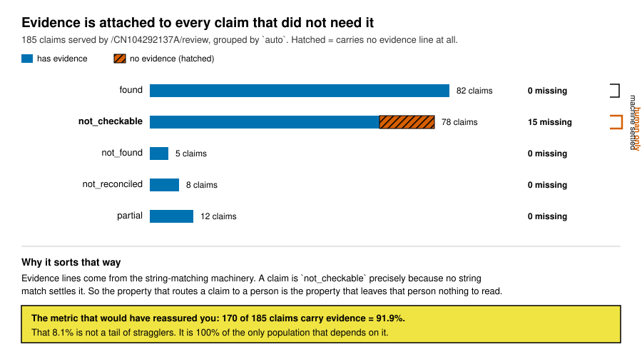

# The evidence is attached to every claim that did not need it

Measured 2026-08-27 against the 185 claims served by `/CN104292137A/review`.

## The measurement

A claim carries evidence when `cited_lines` or `evidence_lines` is non-empty. Fifteen
claims carry neither, and they are not scattered:

    tier      claims    no evidence      pct
    1            109             15    13.8%
    2              6              0     0.0%
    3             50              0     0.0%
    4             20              0     0.0%

Tier 1 is the census: the population every reviewer must hand-check. Tiers 2, 3 and 4
are at exactly zero.

Split by `auto`, the localisation is total:

    auto              claims    no evidence      pct
    found                 82              0     0.0%
    not_checkable         78             15    19.2%
    not_found              5              0     0.0%
    not_reconciled         8              0     0.0%
    partial               12              0     0.0%

Fourteen of the fifteen are field `__patent_self_contradiction__`, about `patent`. The
fifteenth is `drawing.same_molecule`, about `extraction`.

## Why it sorts that way

Evidence lines are attached by the string-matching machinery. A claim is `not_checkable`
precisely because no string match settles it, which is why it was routed to a human. So
the same property that sends a claim to a person is the property that leaves it with
nothing for that person to look at.

**The attachment succeeded on every claim where it was redundant and failed on every
claim where it was load-bearing.** A claim marked `found` already carries the machine's
verdict; the citation is a convenience. A claim marked `not_checkable` has only the
citation, and does not have it.

## Why no metric would have caught it

170 of 185 claims carry evidence. A coverage number reads **91.9%** and looks healthy.
The 8.1% is not a tail of stragglers, it is 100% of the population that depends on it.

This is a sixth entry for `GUARDS-THAT-PASS-ON-ABSENCE.md`, and the first where the
guard is a coverage percentage rather than a check:

    an aggregate over a mixed population cannot tell
    a uniform 92% from a 100% hole inside one stratum

The habit that found it was the same one: the number passed, so ask what it would take
for it to pass while being wrong. Splitting by `auto` took one line and answered it.

## What it costs the reviewer

The intended user is a non-chemist working a 15-minute budget. These fifteen claims ask
them to rule on whether the patent contradicts itself, and hand them nothing to look at.
That is the hardest question in the queue delivered with the least support.

The worst instance is the identity of the target compound. `CN104292137A_p02_x1` asks:

> the route as claimed builds tembotrione rather than sulcotrione. Did we record what
> the patent actually prints, rather than a tidied-up version of it?

It cites zero lines. The patent settles it outright at line 32 of
`input/CN104292137A-fulltext.md`, which prints `除草剂环磺草酮(Tembotrione)` followed by
the tembotrione chemical name, and the route builds the trifluoroethoxymethyl group that
distinguishes the two. The evidence exists, is decisive, and is one line long.

## The fix is a join, not new data

Every one of the fifteen already knows its page. The page is in `record_id`
(`CN104292137A_p02_x3`) and in `stratum` (`patent:page 2`), and the page-scan route
already serves the image. A `__patent_self_contradiction__` claim on page N should show
the page N scan.

Assigned to the write-path lane as part of item 8, which this finding promotes from a
stale banner to the only evidence the hardest fifteen claims can have.
