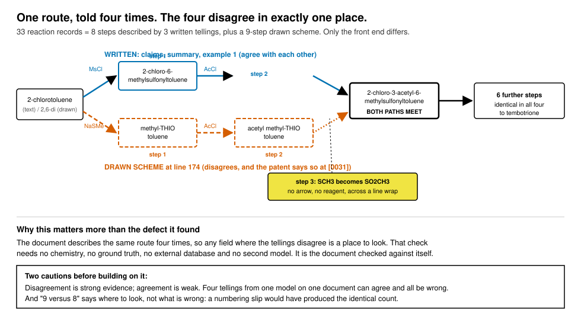

# The patent tells the same route four times, and that is a free verification signal

Measured 2026-08-27 against `output/reactions.json`.

## The shape of the data

33 reaction records. They are not 33 reactions:

    telling                             steps
    Claims                                  8
    Summary of the Invention                8
    Summary of the Invention Scheme         9
    Example 1                               8

One 8-step route to tembotrione, described four times in one document, plus one extra
step in the drawn scheme. The patent contains exactly **one** worked example, so
Example 1 is the only telling that carries quantities.

Aligning the four by product name shows they agree step for step, except that the Scheme
runs one ahead from step 3 onward and terminates at step 9 where the others terminate
at step 8.

## The extra step is real, and the extraction was right about it

My first reading was that the Scheme telling had hallucinated a thioether route, because
its steps 1 and 2 carry methylthio structures (`CSc1cccc(Cl)c1C`) where the other three
tellings say methylsulfonyl, and because the patent text at [0031] says the invention
**eliminates** the thioether:

> 该工艺采用甲磺酰氯替代甲硫醚的氯取代反应，革除了硫醚的过氧化氢氧化步骤
> uses methanesulfonyl chloride in place of the methyl sulfide route, and eliminates the
> thioether hydrogen peroxide oxidation step

That reading was wrong, and checking provenance before writing it down is the only reason
it did not ship. The Scheme records come from a **drawn scheme at line 174**, introduced
by [0029] 本发明所涉及的反应方程式如下. The extraction read the drawing, recorded what was
drawn, and flagged the conflict rather than smoothing it:

    validation_flags   drawing_text_conflict, route_attribution_unclear,
                       reagent_drawn_not_written, no_conditions
    is_complete        false
    step 3 note        "NO ARROW AND NO REAGENT AT ALL ... row 1 ends with the acetylated
                       sulfide at the right margin and row 2 begins with the acetylated
                       sulfone at the left margin, and SCH3 at C4 has silently become SO2CH3"

So the patent's own drawing contradicts the patent's own claimed advantage, and the
drawing does it across a line wrap with no arrow. The extraction caught that, refused to
invent an oxidant, and marked the record incomplete. This is the pipeline at its best.

The reviewer sees it too. Claims `CN104292137A_p06_x1` and `p06_x2` state it in English a
non-chemist can act on, and unlike the fifteen in `EVIDENCE-INVERTS-WITH-NEED.md`, both
carry evidence.

## The transferable point

The four tellings are a verification signal that costs nothing to compute and requires no
chemistry, no external database and no second model:

    the same document describes the same route four times,
    so any field where the tellings disagree is a place to look

It needs no ground truth. It is not an LLM judging an LLM. It is the document checked
against itself, and on this patent it lands on a genuine defect: the one telling that
disagrees is the one the patent drew rather than wrote.

This generalises past this patent. Patents are structurally redundant by drafting
convention: claims restate the summary, the summary restates the abstract, and examples
instantiate all three. That redundancy is normally treated as noise to be deduplicated.
It is better used as a **self-consistency oracle**, and deduplicating it early destroys
the signal.

Two cautions before anyone builds on this:

- **Agreement is weak evidence, disagreement is strong evidence.** Four tellings derived
  by one model from one document can agree and all be wrong together. This finds
  contradictions; it does not confirm correctness. That is the same asymmetry recorded in
  `GUARDS-THAT-PASS-ON-ABSENCE.md`: a guard on presence cannot tell confirmed from
  coincidence.
- **The count alone is not the signal.** "9 versus 8" is where to look, not what is
  wrong. Here it resolved to a real patent defect, but an off-by-one in step numbering
  would have produced the identical count.

## The same check fires a second time, on a different field

The four tellings also disagree about the **reagent** in the final step:

    Claims step 8      cyanoacetone
    Summary step 8     cyanoacetone
    Example 1 step 8   cyanoacetone, catalytic (0.2 g against 198 g of substrate)
    Scheme step 9      acetone cyanohydrin

Cyanoacetone and acetone cyanohydrin are different compounds. The scheme record notes "a
cyanohydrin drawn above the arrow", so the vision pass read a structure, and the three
written tellings read a name. Either the drawing and the text disagree, or one of the two
readings is wrong. Both are worth a human.

This is the second independent defect found by the same check, on a different field, in
the same document. One hit could be luck. Two, on unrelated fields, is the check earning
its place.

The reviewer does see this one. `CN104292137A_p02_x3` and `CN104292137A_p05_x3` both
state it, and `p05_x3` is explicit that it is text-versus-text. But `p02_x3` is one of the
fifteen claims carrying no evidence at all, so the reviewer is told the patent
contradicts itself about a cyanide-adjacent reagent and given no line to look at. See
`EVIDENCE-INVERTS-WITH-NEED.md`.

## A related contradiction the pipeline caught and I did not

[0004] says the invention 革除了 (abolishes) 气味大的甲硫醇钠和剧毒氰基丙酮, the
malodorous sodium methanethiolate and the highly toxic cyanoacetone. Every written
telling of step 8 then uses cyanoacetone.

I found this by hand and assumed it was a gap. It is not. `CN104292137A_p04_x2` already
carries it, with cited line 109 and populated evidence lines, and states the mechanism
more precisely than I had: the prior-art reagent list is split across [0003] and [0004],
so reading either paragraph alone gives an incomplete picture of what the invention
claims to eliminate.

Worth recording that three separate spot-checks of mine this session turned out to be
things the pipeline had already caught and surfaced correctly. The detection layer is
consistently stronger than a reviewer sampling it by hand would guess. The weaknesses are
all in delivery.

## Open

Nothing to fix in the extraction. The one reviewer-facing question is whether the queue
should present the four tellings of a step together, since a reviewer checking step 3
four times in four places spends four times the budget of a reviewer checking it once
with three corroborations shown alongside. Not measured, and not filed as a defect.
